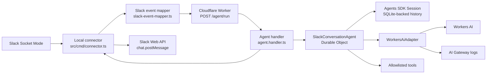
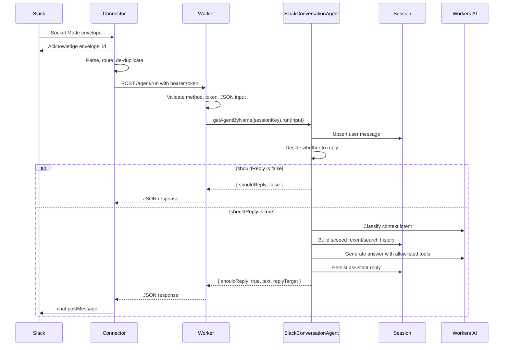
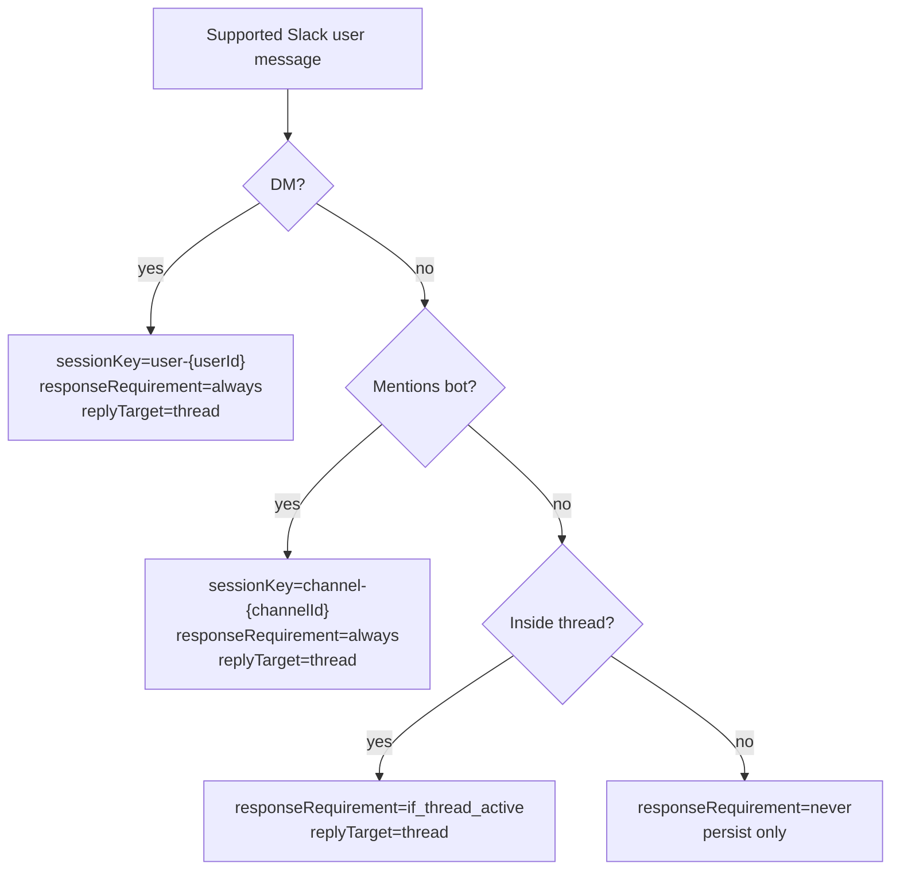
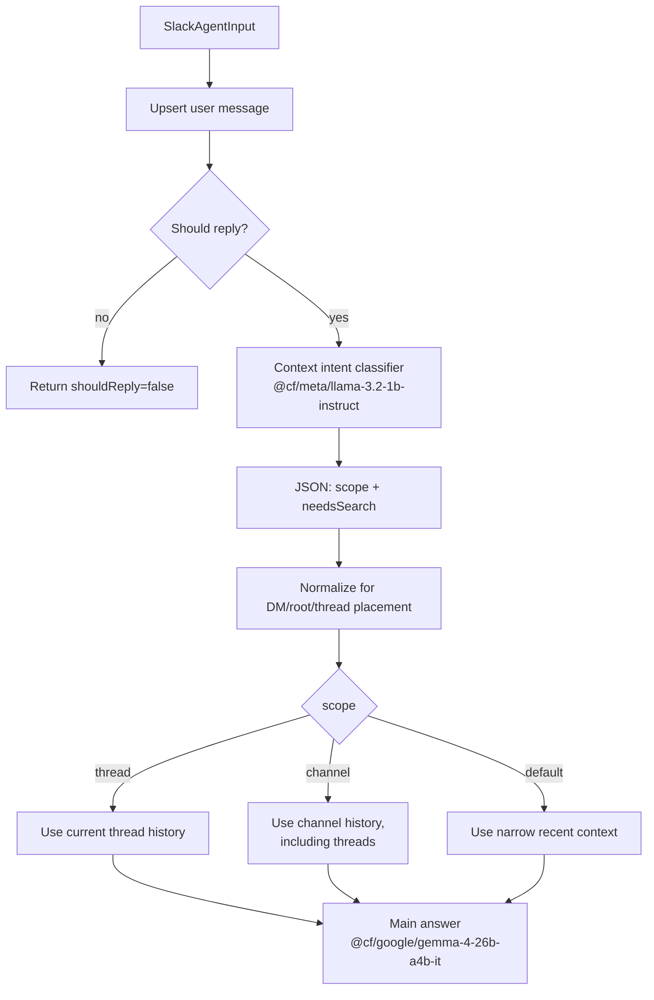

# Slack AI Agent V2

Slack AI Agent V2 is a Cloudflare Workers TypeScript Slack agent. A local Node.js Socket Mode connector owns the Slack WebSocket connection, forwards supported Slack events to a Worker endpoint, and posts replies back to Slack. The Worker keeps the HTTP entrypoint thin and delegates conversation behavior to a Cloudflare Agents SDK `SlackConversationAgent` with SQLite-backed Session history and Workers AI.

## What It Includes

- Local Slack Socket Mode connector in `src/cmd/connector.ts`.
- Thin Cloudflare Worker entrypoint in `src/cmd/worker.ts`.
- Authenticated `POST /agent/run` endpoint in `src/modules/agent/agent.handler.ts`.
- Stateful `SlackConversationAgent` Durable Object in `src/modules/agent/slack-conversation.agent.ts`.
- Cloudflare Agents SDK Session memory for Slack conversation history.
- Workers AI responses through `WorkersAiAdapter`, with AI Gateway metadata.
- Structured LLM context intent classification for thread, channel, or default scope.
- Allowlisted tool calling from `src/modules/agent/agent.tools.ts`.
- Structured JSON logs through `LoggerPort` and `ConsoleLoggerAdapter`.
- Strict TypeScript, ESLint, and Prettier validation.

## Architecture



The connector is intentionally outside the Worker. Slack Socket Mode uses a WebSocket connection that the local Node.js process owns. The Worker receives normalized agent requests over HTTP and can later be deployed independently behind the same `/agent/run` contract.

## Runtime Flow



## Slack Behavior

Direct messages use `user-{userId}` Agent instances and always reply in the user's message thread. Channels use `channel-{channelId}` Agent instances. Channel mentions reply in a thread, and follow-up messages in active bot threads can reply without another mention. Root channel messages without a bot mention are persisted for future context but return `shouldReply: false`.



The connector skips unsupported Slack payloads, bot messages, message subtypes, invalid envelopes, and duplicate Slack messages seen recently.

## Context Scope

`SlackConversationAgent` does not use regex keyword checks to decide whether a request should see thread or channel history. It asks a cheaper Workers AI model for strict JSON context intent, then normalizes the result against Slack placement.



Classifier output has this shape:

```json
{
  "scope": "thread",
  "needsSearch": true,
  "reason": "user asked about this thread"
}
```

If classification fails or returns invalid JSON, the fallback is conservative: thread messages use thread scope with search enabled, and non-thread messages use default scope without search.

## Project Structure

```txt
src/
  adapters/
    cloudflare/workers-ai.adapter.ts
    console/console-logger.adapter.ts
  cmd/
    connector.ts
    worker.ts
  modules/
    agent/
      agent.handler.ts
      agent.tools.ts
      agent.types.ts
      agent.use-case.ts
      slack-conversation.agent.ts
    slack/
      slack-event-mapper.ts
      slack-web-api.client.ts
      slack.types.ts
  ports/
    ai.port.ts
    logger.port.ts
  tools/
    http-response.tool.ts
```

`src/modules/agent/agent.use-case.ts` is legacy/simple orchestration from the pre-session flow. The active Slack runtime path uses `SlackConversationAgent` through `getAgentByName()`.

## Setup

Install dependencies and generate Cloudflare binding types:

```bash
npm install
npm run cf-typegen
```

Create a local environment file:

```bash
cp .env.example .env
```

The local connector reads these values from `.env`:

- `SLACK_APP_TOKEN`: Slack app-level token for Socket Mode, usually `xapp-...`.
- `SLACK_BOT_TOKEN`: Slack bot token for `auth.test`, `conversations.replies`, and `chat.postMessage`, usually `xoxb-...`.
- `WORKER_AGENT_URL`: Worker endpoint, normally `http://localhost:8787/agent/run`.
- `WORKER_CONNECTOR_TOKEN`: shared bearer token used by the connector and Worker.
- `AI_GATEWAY_ID`, `AI_GATEWAY_COLLECT_LOGS`, and `AI_GATEWAY_SOURCE`: AI Gateway logging metadata.

Set the Worker connector token as a Wrangler secret before deploying:

```bash
npx wrangler secret put WORKER_CONNECTOR_TOKEN
```

The Slack app should have these bot scopes for local reply behavior:

- `app_mentions:read`
- `chat:write`
- `channels:history` and/or `groups:history` for channel message events
- `im:history` or equivalent direct message event access

## Development

Run the Worker through Wrangler. Workers AI uses Cloudflare's remote AI service during local development because the AI binding is configured with `remote: true`:

```bash
npm run dev
```

To load local values from `.env`, pass the env file explicitly:

```bash
npm run dev -- --env-file .env
```

Start the Slack Socket Mode connector in a second terminal:

```bash
npm run connector:slack
```

Call the Worker agent endpoint directly:

```bash
curl -X POST http://localhost:8787/agent/run \
  -H "Authorization: Bearer $WORKER_CONNECTOR_TOKEN" \
  -H "Content-Type: application/json" \
  -d '{"sessionKey":"user-local","text":"Hello from curl","userId":"local","channelId":"DLOCAL","channelType":"im","messageTs":"1760000000.000000","threadTs":"1760000000.000000","responseRequirement":"always","replyTarget":{"type":"thread","channelId":"DLOCAL","threadTs":"1760000000.000000"}}'
```

Check service health:

```bash
curl http://localhost:8787/health
```

## VS Code Debugging

This repository includes VS Code launch and task configuration:

- Run `Wrangler: Dev` from Run and Debug to start Wrangler with `.env` and inspector port `9229`.
- Run `Slack Connector: Dev` from Run and Debug to start the connector with `.env`.
- Run the `Worker + Slack Connector` compound configuration to start both processes.
- Run the `wrangler: dev`, `connector: slack`, `wrangler: typegen`, `npm: check`, and `wrangler: deploy` tasks from the command palette when needed.

## Cloudflare Configuration

`wrangler.jsonc` is the source of truth for Worker configuration:

- Worker entrypoint: `src/cmd/worker.ts`.
- Compatibility flag: `nodejs_compat`.
- Workers AI binding: `AI` with `remote: true`.
- Durable Object binding: `SLACK_CONVERSATION_AGENT`.
- SQLite Durable Object migration for `SlackConversationAgent`.
- AI Gateway vars: `AI_GATEWAY_ID`, `AI_GATEWAY_COLLECT_LOGS`, and `AI_GATEWAY_SOURCE`.

Run `npm run cf-typegen` after changing `wrangler.jsonc` so `worker-configuration.d.ts` stays in sync.

## Validation

Run TypeScript, ESLint, and Prettier checks:

```bash
npm run check
```

Useful narrower checks:

```bash
npm run typecheck:worker
npm run typecheck:connector
npm run lint
npm run format:check
```

Format files:

```bash
npm run format
```

## Deployment

Deploy with Wrangler:

```bash
npm run deploy
```

Before deploying, set secrets with Wrangler rather than committing local env files:

```bash
npx wrangler secret put WORKER_CONNECTOR_TOKEN
```

## Development Guidance

- Keep Worker entrypoints thin and place application behavior in feature-first modules.
- Keep Cloudflare bindings and external services behind ports and adapters.
- Keep Slack payload normalization in `src/modules/slack/slack-event-mapper.ts`.
- Keep Slack Web API calls in `src/modules/slack/slack-web-api.client.ts`.
- Keep Workers AI calls behind `WorkersAiAdapter`.
- Keep tool definitions allowlisted in `src/modules/agent/agent.tools.ts`.
- Write repository content in English unless localized content is the explicit deliverable.
