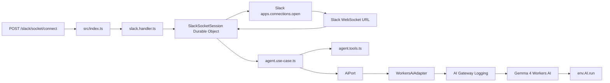

# Minimal Slack Socket Mode Workers AI Template

## Scope

Build a small TypeScript/Wrangler scaffold for a Slack Socket Mode-ready Cloudflare Worker that calls Workers AI through the native `AI` binding and routes AI calls through AI Gateway for request logging. The first version will be intentionally minimal: one health endpoint, one control endpoint to start the Slack Socket Mode connection, a small Durable Object to own the WebSocket session, a Gemma 4-based use case, a small tool-calling surface, an AI port, AI Gateway options, and a Workers AI adapter.

## Files To Add Or Update

- Add [`package.json`](../../package.json) with minimal scripts: `dev`, `deploy`, `typecheck`, and `cf-typegen`.
- Add [`eslint.config.js`](../../eslint.config.js) with a minimal TypeScript ESLint flat config.
- Add [`.prettierrc`](../../.prettierrc) with a small readable formatting policy.
- Add [`tsconfig.json`](../../tsconfig.json) for strict Cloudflare Worker TypeScript.
- Add [`wrangler.jsonc`](../../wrangler.jsonc) with:
  - `main: "src/index.ts"`
  - current `compatibility_date`
  - `ai.binding: "AI"`
  - `durable_objects.bindings` for `SLACK_SOCKET_SESSION`
  - a first Durable Object migration for `SlackSocketSession`
  - minimal non-secret `vars` for AI Gateway logging configuration
- Add [`src/index.ts`](../../src/index.ts) as the thin Worker entrypoint and dependency composition root.
- Add [`src/modules/slack/slack.handler.ts`](../../src/modules/slack/slack.handler.ts) to expose minimal control routes and delegate Socket Mode work.
- Add [`src/modules/slack/slack-socket-session.ts`](../../src/modules/slack/slack-socket-session.ts) as the Durable Object that opens and owns Slack's WebSocket connection.
- Add [`src/modules/slack/slack.types.ts`](../../src/modules/slack/slack.types.ts) for Slack Socket Mode envelope and event DTOs.
- Add [`src/modules/agent/agent.use-case.ts`](../../src/modules/agent/agent.use-case.ts) to orchestrate the AI response.
- Add [`src/modules/agent/agent.tools.ts`](../../src/modules/agent/agent.tools.ts) with a minimal allowlisted tool definition and execution hook so the model can use structured tools from the start.
- Add [`src/modules/agent/agent.types.ts`](../../src/modules/agent/agent.types.ts) for agent input, model settings, tool calls, and output DTOs.
- Add [`src/ports/ai.port.ts`](../../src/ports/ai.port.ts) to keep use cases independent from Cloudflare bindings.
- Add [`src/adapters/cloudflare/workers-ai.adapter.ts`](../../src/adapters/cloudflare/workers-ai.adapter.ts) for `env.AI.run()` with AI Gateway logging options.
- Add [`src/tools/http-response.tool.ts`](../../src/tools/http-response.tool.ts) only for small reusable JSON response helpers.
- Update [`README.md`](../../README.md) with setup and usage commands.

## Runtime Flow

Slack Socket Mode does not use a public Slack Request URL. The Worker will call Slack's `apps.connections.open` API with an app-level token, receive a temporary WebSocket URL, then connect to it and process envelopes over that socket.

The Worker will expose:

- `GET /health` returns service status.
- `POST /slack/socket/connect` asks the `SlackSocketSession` Durable Object to open or refresh the Slack Socket Mode WebSocket connection.
- `POST /slack/socket/disconnect` closes the active Socket Mode connection for local testing or redeploys.

For each Slack envelope:

- Parse the WebSocket message.
- Immediately acknowledge messages with an `envelope_id` by sending `{ "envelope_id": "..." }` over the same WebSocket.
- For supported message events, extract the Slack text and call the agent use case.
- Run the agent with Gemma 4 and pass allowlisted tool definitions to the model.
- Execute only validated tool calls from `agent.tools.ts`, then return the tool result to the model when a follow-up response is needed.
- Route every Workers AI inference call through AI Gateway with logging enabled.
- In the minimal template, log or return the generated response path cleanly; sending real Slack replies can be added next through a Slack Web API port and adapter.

## Architecture



## Model Choice

Use Gemma 4 as the starting model:

```ts
const DEFAULT_MODEL = "@cf/google/gemma-4-26b-a4b-it";
```

The template should treat model choice as configuration, but default to Gemma 4 because it supports the capabilities needed for this agent direction:

- Reasoning-capable responses for complex Slack requests.
- Native function calling/tool use for future agent workflows.
- Streaming support for real-time response paths where the transport can use it.
- Large context window for longer Slack conversations and tool definitions.
- Vision-capable model family support for future file/image handling, without implementing file ingestion in the first template.

Do not expose hidden chain-of-thought to Slack users. If the model or API returns reasoning metadata, keep user-facing responses focused on the final answer.

## AI Gateway Logging

Use AI Gateway through the Workers AI binding call, with minimal non-secret settings coming from [`wrangler.jsonc`](../../wrangler.jsonc):

```jsonc
{
  "vars": {
    "AI_GATEWAY_ID": "default",
    "AI_GATEWAY_COLLECT_LOGS": true,
    "AI_GATEWAY_SOURCE": "slack-socket-mode",
  },
}
```

The adapter should read these values from generated `Env` types and pass them to Workers AI:

```ts
await env.AI.run(model, input, {
  gateway: {
    id: env.AI_GATEWAY_ID,
    collectLog: env.AI_GATEWAY_COLLECT_LOGS,
    metadata: {
      source: env.AI_GATEWAY_SOURCE,
    },
  },
});
```

Keep these values centralized in Wrangler config so they can be changed without touching handlers. Start with `"default"` to avoid manual gateway setup and to let Cloudflare use the default gateway for the account. Attach safe metadata such as Slack event type, channel ID, and request source when available, but do not attach secrets or full tokens.

## Tooling

Run and deploy the project through Wrangler only:

```bash
npm run dev -- --remote
npm run deploy
```

Keep configuration minimal:

- `wrangler.jsonc` should include only the Worker entrypoint, compatibility date, AI binding, Durable Object binding, required migration, and minimal non-secret AI Gateway vars.
- Do not add optional observability, KV/D1/R2, Queues, Vectorize, AI Gateway caching rules, or Slack Web API config in the initial template.
- Configure AI Gateway execution in code through the `env.AI.run()` gateway option, but keep gateway ID/logging/source values in Wrangler `vars`.
- Keep secrets out of config; set `SLACK_APP_TOKEN` with Wrangler secrets.

Add lightweight readability tooling:

- `npm run lint` for TypeScript linting.
- `npm run format` for Prettier formatting.
- `npm run check` for `typecheck`, `lint`, and `format:check`.
- No custom style-heavy configuration; use a small Prettier config and let code stay easy to scan.

## Plan Preservation

After approval and before implementation, save this full approved plan in [`proto/features/`](../) using the repository naming rule:

```txt
proto/features/{index}-2026-06-04-slack-socket-mode-worker-ai-template.md
```

Use the next available sequential index based on existing files in `proto/features/`. The saved feature document must be in English.

The saved document must preserve the complete plan, not a condensed summary. Include:

- Scope and goals.
- File-by-file implementation plan.
- Runtime flow.
- Mermaid architecture diagram.
- Model choice and reasoning/tool/streaming requirements.
- Tooling and minimal configuration rules.
- Implementation notes.
- Validation commands.
- Ordered implementation steps/todos.

## Implementation Notes

- Use the native Workers AI binding, not the deprecated `@cloudflare/ai` package.
- Keep `env.AI` access only inside `WorkersAiAdapter` and initial dependency wiring in `src/index.ts`.
- Store the Slack app-level token as a Wrangler secret such as `SLACK_APP_TOKEN`; do not commit it to config or source.
- Use Slack Socket Mode acknowledgement semantics: send the received `envelope_id` back within Slack's expected acknowledgement window.
- Use `@cf/google/gemma-4-26b-a4b-it` as the default model, with model ID centralized so it can be replaced later without touching handlers.
- Route model calls through AI Gateway using `AI_GATEWAY_ID`, `AI_GATEWAY_COLLECT_LOGS`, and `AI_GATEWAY_SOURCE` from Wrangler vars.
- Keep tool calls allowlisted and schema-validated; never let the model invoke arbitrary code or external services.
- Do not add HTTP Slack signature verification in this template because Socket Mode events arrive over Slack's authenticated WebSocket flow, not a public Slack request URL.
- Keep Slack Web API posting behind a future `MessengerPort`/adapter if actual channel replies are added.
- Keep repository content in English.

## Validation

After implementation, run:

```bash
npm install
npm run cf-typegen
npm run check
```

For local AI testing, use:

```bash
npm run dev -- --remote
```

## Ordered Implementation Steps

1. Save the approved full plan under `proto/features/` using the repository Plan Mode feature document naming rule.
2. Add minimal npm, TypeScript, Wrangler, ESLint, Prettier, Workers AI, and Durable Object configuration.
3. Implement the thin Worker entrypoint, Slack Socket Mode connector, Gemma 4 agent use case, tool definitions, AI Gateway logging, AI port, and Workers AI adapter.
4. Update `README.md` with setup, local remote dev, sample control requests, and deployment commands.
5. Install dependencies if needed, generate Cloudflare types, and run TypeScript validation.
