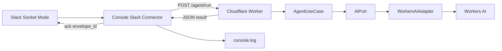

# Slack Console Connector

## Scope

Move Slack Socket Mode listening out of the Cloudflare Worker into a separate local console connector. The connector will receive Slack Socket Mode events, acknowledge envelopes over the Slack WebSocket, send normalized message events to the Worker, and print the Workers AI response to the console.

The Worker will stop owning the Slack WebSocket session. It will expose a small authenticated HTTP endpoint that runs the existing Workers AI agent use case and returns a JSON result.

Slack Web API replies are intentionally out of scope for this change. The connector should only listen, call the Worker, and log the response.

Executable entrypoints live under `src/cmd`: `src/cmd/worker.ts` for the Cloudflare Worker and `src/cmd/connector.ts` for the local Slack connector.

## Target Architecture



## Runtime Flow

1. Start the Worker with Wrangler.
2. Start the Slack console connector in a second process.
3. The connector reads `SLACK_APP_TOKEN`, calls Slack `apps.connections.open`, and opens the returned WebSocket URL.
4. For each Slack Socket Mode message, the connector parses the envelope and immediately acknowledges `envelope_id` over the same WebSocket.
5. The connector filters supported user message events and maps them to `{ text, userId, channelId }`.
6. The connector sends the mapped input to `POST /agent/run` with `Authorization: Bearer <WORKER_CONNECTOR_TOKEN>`.
7. The Worker validates the request, composes `WorkersAiAdapter` and `AgentUseCase`, runs Workers AI, and returns the result.
8. The connector logs the AI response and metadata to the console.

## Implementation Steps

### 1. Worker Agent Endpoint

- Move the Worker entrypoint to `src/cmd/worker.ts` and point `wrangler.jsonc` `main` at that file.
- Keep `GET /health` in `src/cmd/worker.ts`.
- Add `POST /agent/run` and route it to a new `src/modules/agent/agent.handler.ts`.
- Validate method, bearer token, and JSON input.
- Use the existing `AgentUseCase` and `WorkersAiAdapter`; do not put AI orchestration in `src/cmd/worker.ts`.
- Return a safe JSON response with the generated text, tool calls, and optional AI Gateway log ID.

### 2. Slack Console Connector

- Add `src/cmd/connector.ts` as the console app entrypoint.
- Read `SLACK_APP_TOKEN`, `WORKER_AGENT_URL`, and `WORKER_CONNECTOR_TOKEN` from the process environment.
- Call Slack `apps.connections.open`, open the WebSocket URL, and register lifecycle handlers.
- Parse Socket Mode envelopes, acknowledge `envelope_id`, extract supported user message events, call the Worker endpoint, and print the response.

### 3. Slack Parsing And Mapping

- Move reusable Slack parsing and message extraction into `src/modules/slack/slack-event-mapper.ts`.
- Keep DTOs in `src/modules/slack/slack.types.ts`.
- Reuse the mapper from the connector so Slack payload handling stays centralized.

### 4. Remove Worker-Owned Socket Mode

- Remove the Worker route that controls `/slack/socket/connect` and `/slack/socket/disconnect`.
- Remove the `SlackSocketSession` Durable Object export and binding from runtime configuration.
- Remove the Durable Object migration from `wrangler.jsonc` because the Worker no longer owns a Socket Mode session.

### 5. Scripts And TypeScript Configuration

- Add `connector:slack` to `package.json`.
- Add minimal Node tooling for the connector.
- Keep Worker TypeScript settings separate from Node connector settings so `src/cmd/connector.ts` Node types do not leak into the Worker build.
- Regenerate Cloudflare binding types after `wrangler.jsonc` changes.

### 6. VS Code Workflow

- Update `.vscode/tasks.json` with a dedicated connector task.
- Keep the Wrangler dev task for the Worker.
- Update `.vscode/launch.json` with a connector launch configuration and a compound configuration for starting both the Worker and connector when practical.
- Keep `.vscode/settings.json` minimal unless a repository-local setting is required.

### 7. Documentation

- Update `.env.example` with the connector and Worker endpoint environment variables.
- Update `README.md` to describe the two-process local development flow.
- Keep secret handling guidance clear: use `.env` locally and Wrangler secrets for deployed Worker-only secrets.

## Configuration

Local connector variables:

```txt
SLACK_APP_TOKEN=xapp-your-slack-app-level-token
WORKER_AGENT_URL=http://localhost:8787/agent/run
WORKER_CONNECTOR_TOKEN=replace-with-a-local-shared-secret
```

Worker variables and secrets:

- `AI_GATEWAY_ID`
- `AI_GATEWAY_COLLECT_LOGS`
- `AI_GATEWAY_SOURCE`
- `WORKER_CONNECTOR_TOKEN`

## Validation

- Run `npm run cf-typegen`.
- Run `npm run check`.
- Start Wrangler with `npm run dev -- --env-file .env`.
- Start the connector with `npm run connector:slack`.
- Send a Slack message event and confirm that the connector logs the Worker AI response.
