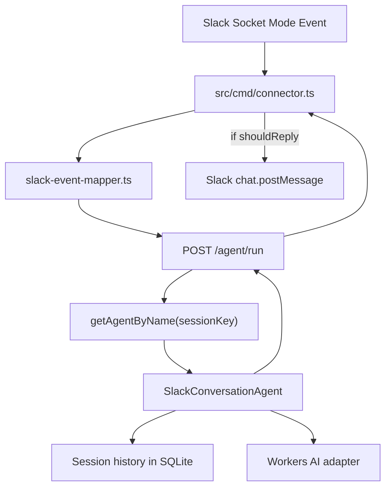

# Slack Sessions

## Scope

Add Cloudflare Agents SDK sessions so Slack direct messages and channel conversations are persisted and used as context. Direct messages use `user-{userId}` session keys. Channels use `channel-{channelId}` session keys and store both replied and ignored user messages with Slack metadata.

## Recommended Approach

Use a Cloudflare Agents SDK `Agent` as the owner of `/agent/run`. The Worker handler routes each Slack event to a named Agent instance with `getAgentByName()`:

- DM session key: `user-{userId}`
- Channel session key: `channel-{channelId}`

Inside each Agent instance, use `Session.create(this)` from `agents/experimental/memory/session` for conversation history. This is better than `this.state` for message history because the Agents SDK docs recommend keeping Agent state small and using SQLite/session history for large collections. `this.state` can later hold lightweight counters or active thread ids, but full Slack messages should live in Session history.

## Why This Shape

- `Session` stores conversation history in SQLite and survives Durable Object hibernation and eviction.
- `Session.search()` gives full-text search, useful for requests like “summarize everything from today”.
- Compaction can later summarize older history without deleting original messages.
- One Agent instance per `user-*` or `channel-*` key keeps isolation simple and avoids `SessionManager` complexity for now.
- Channel sessions can store all supported channel messages, including ignored messages, so later replies have broader context.

## Target Flow

## Session Data Model

Store every Slack event as a `SessionMessage` with deterministic IDs so duplicate Slack deliveries can be upserted safely.

For user/channel messages:

- `id`: `slack-user-{channelId}-{messageTs}`
- `role`: `user`
- `createdAt`: Slack `ts` converted to ISO timestamp if practical
- `parts`: text content with lightweight metadata rendered into the text or supported metadata if the Session type allows it

Slack metadata to preserve:

- `slackUserId`
- `channelId`
- `channelType`
- `messageTs`
- `threadTs` if present
- `isThreadMessage`
- `shouldReply`
- `replyTarget`
- `responded` after assistant reply

For assistant replies:

- `id`: `slack-assistant-{channelId}-{assistantMessageTs}` after Slack post if available, or a generated id before posting
- `role`: `assistant`
- `parts`: response text
- same channel/thread metadata

## Routing Changes

The connector should forward all supported user messages to the Worker, not only messages that require a reply. The Worker/Agent then decides whether to answer.

Recommended response decision inside the Agent:

- DM: store message and respond.
- Channel root mention: store message, mark thread active, respond in thread.
- Channel thread message without mention: store message and respond only if the thread is active in that channel session.
- Channel root message without mention: store message but return `shouldReply: false`.
- Bot messages/subtypes: still ignore to prevent loops.

This replaces Slack `conversations.replies` as the primary thread participation source. Slack history lookup can remain as an optional fallback for pre-existing threads after deploy.

## Implementation Steps

1. Save this approved plan under `proto/features/{index}-2026-06-04-slack-sessions.md` in English before code changes.
2. Add the `agents` package and update `wrangler.jsonc` with a Durable Object binding and SQLite migration for `SlackConversationAgent`; run `npm run cf-typegen`.
3. Add `src/modules/agent/slack-conversation.agent.ts` that extends `Agent<Env, State>` and owns session history, active thread tracking, AI generation, and reply decision.
4. Extend Slack DTOs and Worker input/output types so every supported Slack event carries `sessionKey`, reply target, timestamps, thread id, and whether it initially looked reply-worthy.
5. Update `src/cmd/connector.ts` to forward all supported user messages to `/agent/run`, then post only when the Worker returns `shouldReply: true`.
6. Update `src/modules/agent/agent.handler.ts` to authenticate the connector, parse input, resolve `getAgentByName(env.SLACK_CONVERSATION_AGENT, sessionKey)`, and call the Agent method.
7. Move or reuse current `AgentUseCase` AI logic inside the Agent while preserving ports/adapters boundaries as much as possible.
8. Add search/history handling for summary-style requests: start with recent `getHistory()` context plus optional `session.search()` when the user asks for summaries, dates, or previous discussion.
9. Update `README.md`, `AGENTS.md`, `.env.example` only if setup/runtime guidance changes.
10. Validate with `npm run cf-typegen` and `npm run check`, then manually test DM, channel mention, ignored channel messages, thread continuation, and summary request.

## Important Tradeoffs

- Session API is currently experimental (`agents/experimental/memory/session`), so import paths may change. The benefit is that it gives the exact memory model we need now.
- One channel session can grow large. That is acceptable for the first implementation because Session history supports search and compaction, but compaction should be added soon after the basic flow works.
- A single `channel-{id}` session makes “summarize today” easy, but thread-specific answers need careful filtering by `threadTs` so unrelated channel chatter does not dominate the answer.
- Existing active threads from before this deployment will not be known unless Slack `conversations.replies` fallback remains or they are bootstrapped manually.
