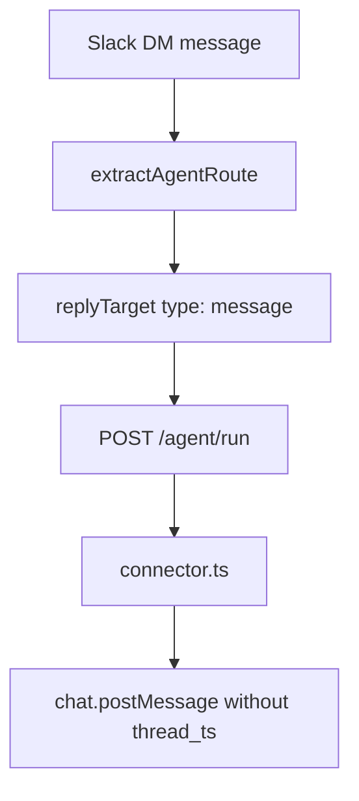
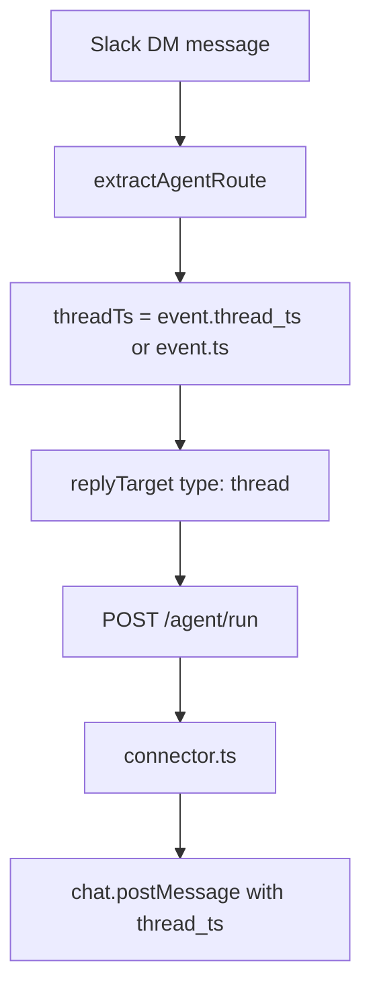

# Slack DM Thread Replies

## Scope

Change direct-message Slack replies so the bot answers in the thread of the user's message instead of posting a normal top-level DM message. If the user continues the conversation in that DM thread, the bot should keep answering in the same thread.

Channel mention and channel thread continuation behavior should remain unchanged.

## Current Behavior

Direct messages currently route to a plain message reply target:



## Target Behavior

Direct messages should route to a thread reply target using the existing Slack timestamp fields:



## Implementation Notes

- Update `src/modules/slack/slack-event-mapper.ts` in the `event.channel_type === "im"` branch.
- Build the DM reply target as `{ type: "thread", channelId, threadTs }`, where `threadTs = event.thread_ts ?? event.ts`.
- Return `null` for a DM event without `thread_ts` or `ts`, because the connector cannot safely create a Slack thread target.
- Pass the effective `threadTs` into the Worker input so logs, AI Gateway metadata, and session history reflect the thread id even for the first root DM message.
- Keep `src/modules/slack/slack-web-api.client.ts` unchanged because it already sends `thread_ts` for thread reply targets.

## Validation

Run repository validation:

```bash
npm run check
```

Manual Slack scenarios:

1. Send the bot a new direct message. The bot replies in that message's thread.
2. Reply in that DM thread. The bot replies in the same thread.
3. Mention the bot in a channel root message. The bot still replies in a channel thread.
4. Reply in an active channel thread without mentioning the bot. The bot still replies in that same channel thread.
5. Confirm bot messages are ignored and do not create loops.
