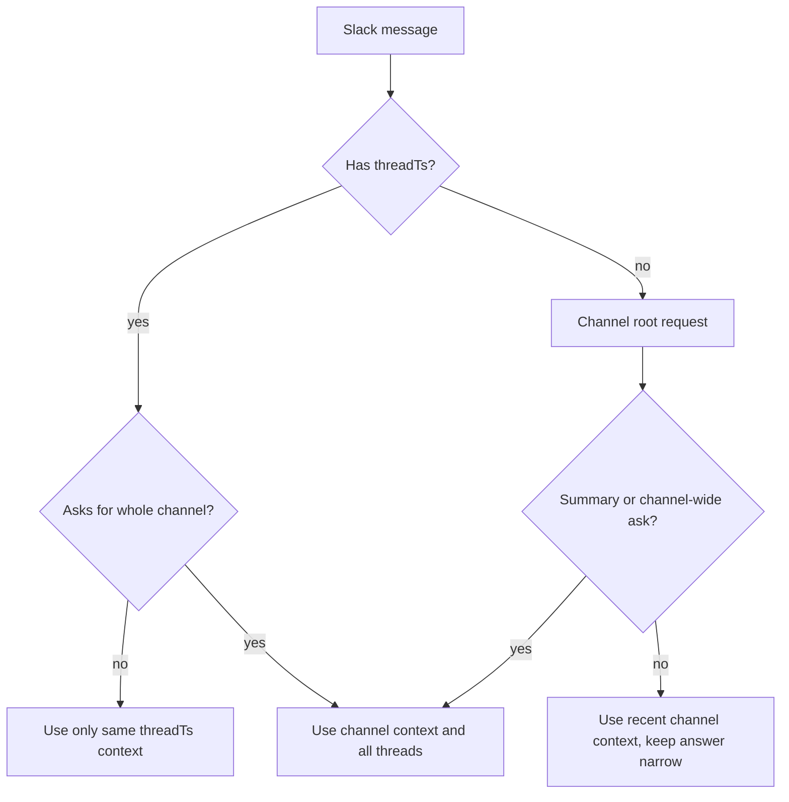

# Slack Context Scope Plan

## Current State

- Channel sessions are already stored as `channel-{channelId}`, so the Durable Object has history for the whole channel: `src/modules/slack/slack-event-mapper.ts`.
- Each message already includes metadata for `channel`, `messageTs`, `threadTs`, `replyTarget`, and `shouldReply`: `src/modules/agent/slack-conversation.agent.ts`.
- The AI request currently receives the latest `MAX_HISTORY_MESSAGES` from the whole session, and optional `session.search()` also searches the whole session without checking whether the user is writing inside a thread: `src/modules/agent/slack-conversation.agent.ts`.

## Proposed Behavior

- If the message is inside a thread and the user does not ask for the whole channel, the AI sees only messages with the same `threadTs`.
- If the message is inside a thread and the user explicitly asks for the whole channel, the AI sees the current channel history, including messages from all threads.
- If a root channel message asks to summarize or recap the channel, the AI sees the whole channel and all threads.
- If a root channel message is just a normal question, the answer stays narrow: do not pull in broad channel history unless needed, but keep normal recent context available.
- After the first root reply, the bot continues replying in the thread, and follow-up context is thread-scoped until the user explicitly asks for a broader channel scope.

## Implementation

- In `src/modules/agent/slack-conversation.agent.ts`, add small pure helpers for context scope detection:
  - `thread` for thread messages by default;
  - `channel` for explicit "whole channel / весь канал / всі треди" requests;
  - `default` for root messages without explicit broad intent.
- In the same file, replace the direct `historyToAiMessages(history).slice(-MAX_HISTORY_MESSAGES)` call with scoped history building:
  - for `thread`, keep only records with the same `threadTs`;
  - for `channel`, keep records from the current channel session without thread filtering;
  - for `default`, keep the current behavior, but add a system instruction not to summarize unrelated context unless explicitly requested.
- Restrict `buildSearchContext()` with the same scope:
  - for `thread`, discard search results whose metadata does not include the current `threadTs`;
  - for `channel`, allow all results from the current channel session;
  - for `default`, search only when the text clearly looks like a summary or history request.
- Add a short system context message for the current scope, for example: "This request is scoped to the current Slack thread unless the user explicitly asks for the whole channel."
- Minimally extend `RunAgentInput` only if the current `channelId`, `threadTs`, `messageTs`, and `replyTarget` fields are not enough. Based on the current code, new fields are likely unnecessary.

## Validation

- Run `npm run check`.
- Manual Slack scenarios:
  - `summarize` inside a thread summarizes only that thread;
  - `summarize whole channel` inside a thread summarizes the current channel and all its threads;
  - root `summarize channel` summarizes the channel and its threads;
  - a normal root question does not pull in unrelated history;
  - a follow-up in a bot-created thread uses only that thread's context.
