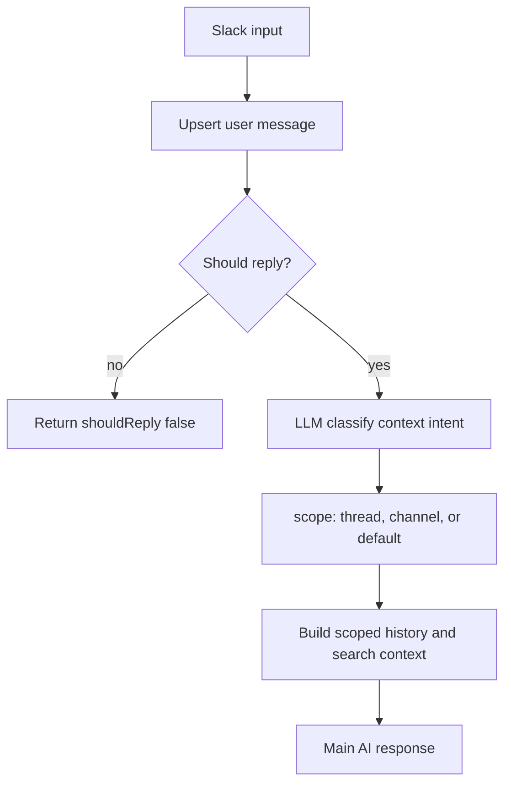

# Structured Slack Scope Intent Plan

## Goal

Replace brittle regex-based `thread` vs `channel` scope detection with a small structured LLM classification step in `src/modules/agent/slack-conversation.agent.ts`. The classifier should use a separate cheap and fast Workers AI model and return strict JSON, after which the main AI request receives the correct scoped history.

## Behavior

- In a thread, the classifier returns `thread` unless the user asks for wider context.
- In a thread, the classifier returns `channel` when the user asks for "по всьому каналу", "all channel", "including all threads", or any similar phrasing.
- In a root channel message, the classifier returns `channel` for channel-wide summarize, recap, or history requests.
- In a root channel message, the classifier returns `default` for a normal question, so the Agent does not pull in unnecessary channel context.
- On parse or model errors, fallback is conservative: `thread` for thread messages and `default` otherwise. This avoids reintroducing regex-based scope decisions.

## Implementation

- In `src/modules/agent/slack-conversation.agent.ts`:
  - add a separate `CONTEXT_INTENT_MODEL`, defaulting to `@cf/meta/llama-3.2-1b-instruct`, so the classifier does not use the main `@cf/google/gemma-4-26b-a4b-it` response model;
  - keep classifier output very short through low `max_tokens` or an equivalent adapter option, if `WorkersAiAdapter` supports it or can be minimally extended;
  - add `SlackContextIntent` with `scope: "thread" | "channel" | "default"` and `needsSearch: boolean`;
  - add `classifyContextIntent(ai, input)` before `buildGenerateTextInput()` or before scoped history construction;
  - make the classification prompt require JSON only, without markdown, for example `{ "scope": "channel", "needsSearch": true, "reason": "user asked for all channel" }`;
  - parse JSON through a small safe parser/helper in the same file, or through an existing lightweight local helper if one exists;
  - do not pass tools to the classifier, keeping it cheaper and more deterministic.
- Optionally add a binding/config var such as `AI_CONTEXT_INTENT_MODEL` if we want to change the classifier model without code changes. If we do not want to touch config now, keep a code constant and move it to config later.
- Replace `determineContextScope(input)` with the classifier result, and replace `shouldSearchHistory(input.text)` with `intent.needsSearch` for `buildSearchContext()`.
- Remove or stop using `requestsWholeChannelContext()` regex for scope decisions.
- Strengthen fallback and logging:
  - log the raw classifier text and normalized intent;
  - log a warning for invalid JSON and use conservative fallback behavior.
- Keep the existing scoped filtering:
  - `thread` filters by `threadTs`;
  - `channel` uses the channel session with root messages and all threads;
  - `default` remains narrow.

## Validation

- Run `npm run check`.
- Manual Slack scenarios:
  - in a thread: `summarize` -> only that thread;
  - in a thread: `Summarize please all channel` -> the whole channel and all threads;
  - in a thread: `зроби summarize по всьому каналу` -> the whole channel and all threads;
  - root: `summarize channel` -> the whole channel and all threads;
  - root: a normal question -> narrow/default context.
